<div align="center">

# 🧬 1M17-CADD-Pipeline

### AI-Assisted Structure-Based Drug Discovery of EGFR Kinase Domain (1M17)

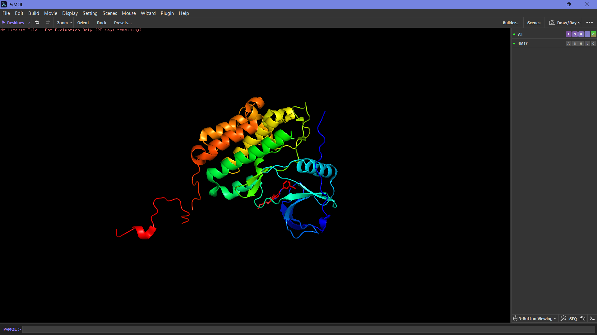

<br>


### Computational Biology × Structural Bioinformatics × AI

</div>

---

# 🌍 Overview

This repository presents a complete **Computer-Aided Drug Design (CADD)** workflow targeting the **Epidermal Growth Factor Receptor (EGFR) Kinase Domain** using the experimentally resolved protein structure **1M17**.

The project integrates:

- 🎯 Binding Site Prediction
- 🧬 Protein Preparation
- 💊 Drug-Likeness Screening
- ⚡ Molecular Docking
- 🔗 Protein–Ligand Interaction Analysis
- 📊 ADMET Profiling
- 🤖 AI-Based Structure Validation

to evaluate clinically relevant EGFR inhibitors through a modern structure-based drug discovery workflow.

---

# 🦠 Target Protein

<div align="center">


</div>

## Protein Information

| Parameter | Value |
|------------|------------|
| Protein Name | Epidermal Growth Factor Receptor (EGFR) Kinase Domain |
| PDB ID | 1M17 |
| Experimental Method | X-Ray Crystallography |
| Resolution | 2.60 Å |
| Co-crystallized Ligand | Erlotinib |
| Target Relevance | Cancer-Associated Receptor Tyrosine Kinase |

---

# 🎯 Research Objective

To computationally evaluate EGFR inhibitors against the EGFR kinase domain through:

✅ Protein target evaluation

✅ Binding site prediction

✅ Protein preparation

✅ Drug-likeness screening

✅ Molecular docking

✅ ADMET profiling

✅ AI-assisted structural validation

---

# ⚙️ Computational Workflow

```mermaid
flowchart LR

A[1M17 Structure]
--> B[Protein Evaluation]

B --> C[DoGSiteScorer]

C --> D[Binding Site Prediction]

D --> E[UCSF Chimera]

E --> F[Protein Preparation]

F --> G[SwissADME]

G --> H[Drug-Likeness Screening]

H --> I[PyRx Docking]

I --> J[Discovery Studio]

J --> K[Interaction Analysis]

K --> L[ADMETlab 3.0]

L --> M[AlphaFold3]

M --> N[PyMOL Alignment]

N --> O[Structural Validation]
```

---

# 🎯 Binding Site Identification

Binding pocket prediction was performed using **DoGSiteScorer**, identifying the biologically relevant active site associated with Erlotinib binding.

<div align="center">

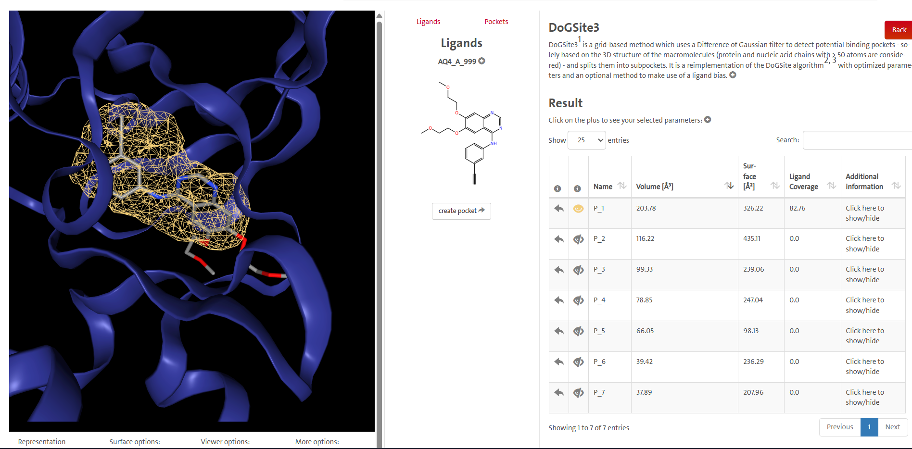

</div>

---

## Active Site Residues

<div align="center">

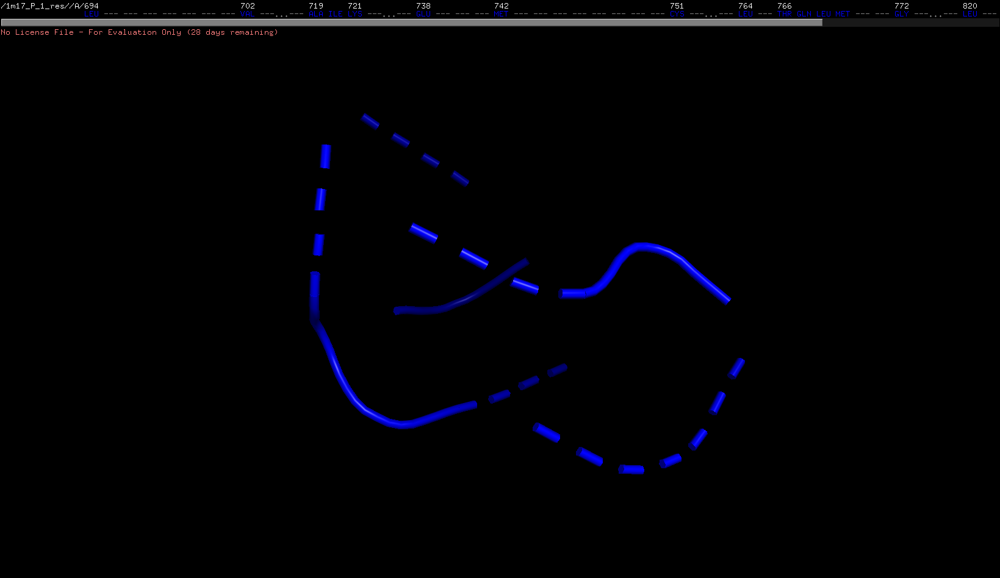

</div>

```text
LEU694
VAL702
ALA719
ILE720
LYS721
GLU738
MET742
CYS751
LEU764
THR766
GLN767
LEU768
MET769
GLY772
LEU820
THR830
ASP831
```

### Key Observation

The predicted binding pocket overlapped directly with the co-crystallized Erlotinib binding region, confirming biological relevance and active-site accuracy.

---

# 🧬 Protein Preparation

Protein preparation was performed using UCSF Chimera to generate a docking-ready protein structure.

<div align="center">

<table>
<tr>

<td align="center">

### Before Preparation

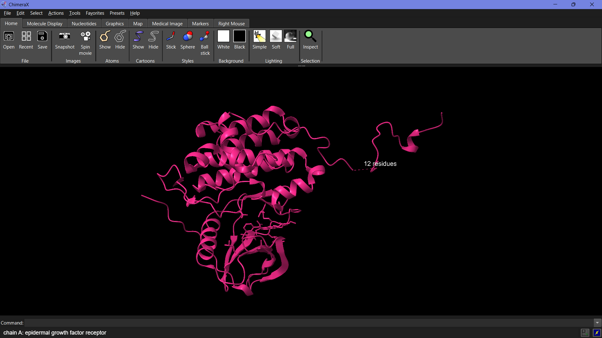

</td>

<td align="center">

### After Preparation

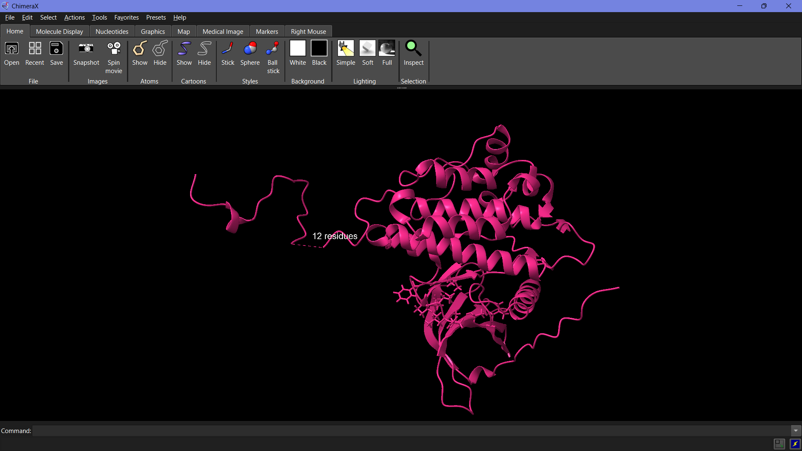

</td>

</tr>
</table>

</div>

### Preparation Workflow

- Chain A Selection
- Water Molecule Removal
- Heteroatom Removal
- Hydrogen Addition
- Charge Assignment via Dock Prep

Output:

```text
1M17_prepared.pdb
```

---

# 💊 Drug-Likeness Screening

Drug-likeness analysis was performed using SwissADME based on Lipinski's Rule of Five.

<div align="center">

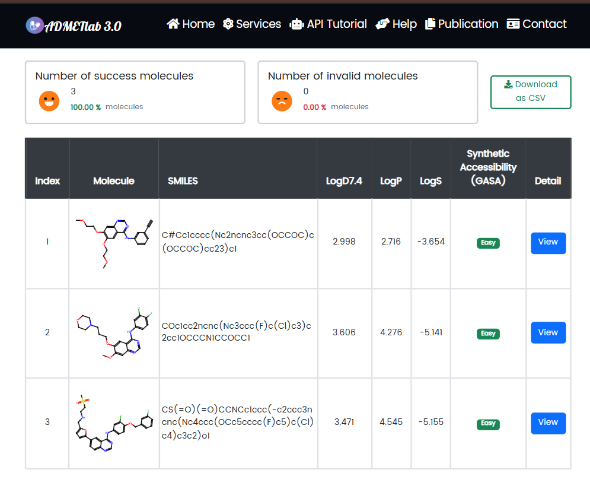

</div>

## Evaluated Compounds

| Compound | Drug-Like |
|-----------|-----------|
| Erlotinib | ✅ Yes |
| Gefitinib | ✅ Yes |
| Lapatinib | ⚠ Partial |

### Key Finding

Erlotinib and Gefitinib demonstrated favorable oral drug-like characteristics, while Lapatinib exceeded the recommended molecular weight threshold.

---

# ⚡ Molecular Docking

Molecular docking was performed using PyRx (AutoDock Vina) to evaluate ligand affinity toward the EGFR active site.

## Docking Scores

| Compound | Binding Affinity (kcal/mol) |
|------------|------------|
| **Lapatinib** | **-11.6** |
| Gefitinib | -8.6 |
| Erlotinib | -8.3 |

### Key Finding

Lapatinib demonstrated the strongest predicted interaction with the EGFR kinase domain based on docking score and molecular interaction stability.

---

# 🔗 Protein–Ligand Interaction Analysis

Interaction analysis was performed using BIOVIA Discovery Studio.

---

## Erlotinib

<div align="center">

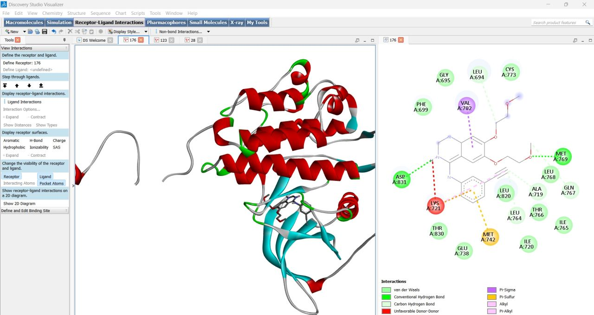

</div>

---

## Gefitinib

<div align="center">

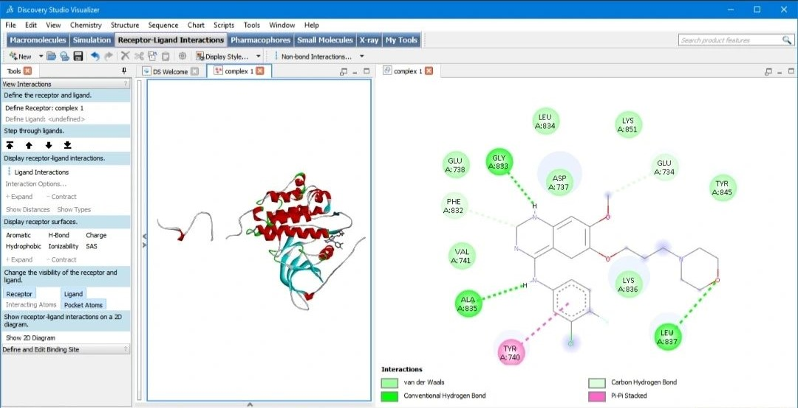

</div>

---

## Lapatinib

<div align="center">

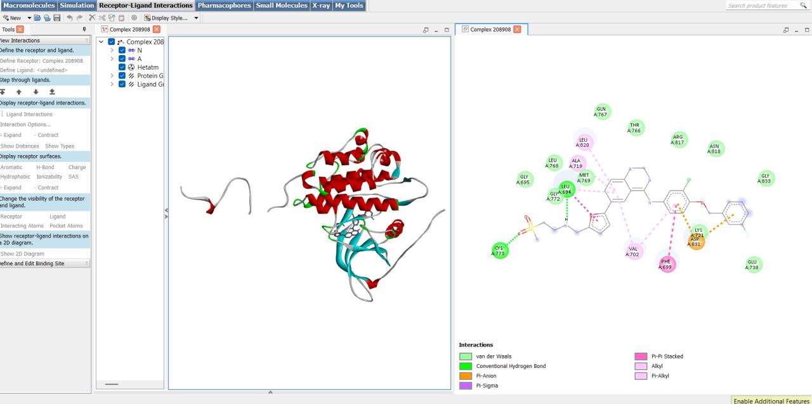

</div>

---

### Comparative Analysis

Lapatinib demonstrated the most extensive hydrogen bonding and hydrophobic interaction network within the active site, supporting its superior docking affinity.

---

# 📊 ADMET Profiling

ADMET prediction was conducted using ADMETlab 3.0.

<div align="center">

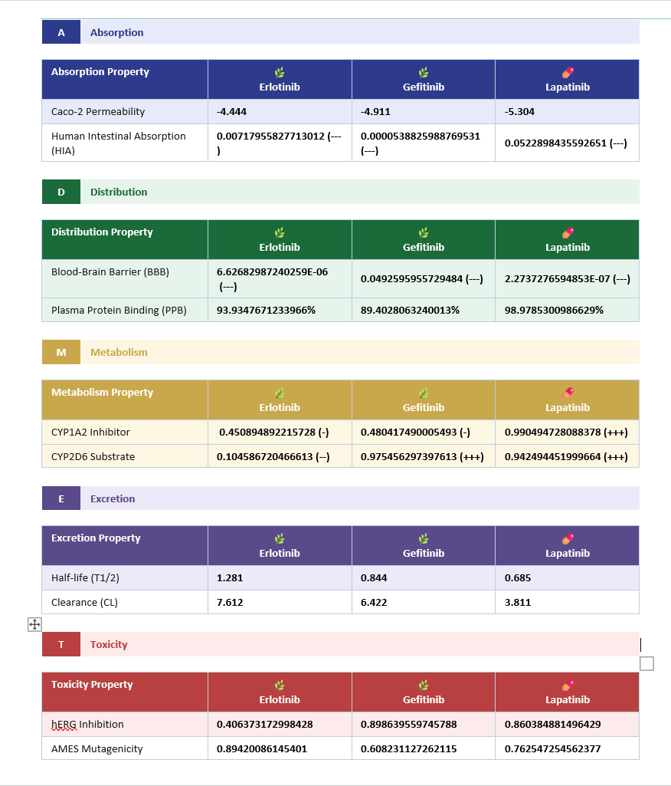

</div>

### Major Findings

⭐ Erlotinib demonstrated the most balanced overall ADMET profile.

⚠ Gefitinib showed elevated hERG inhibition risk.

⚠ Lapatinib displayed stronger plasma protein binding and increased metabolic interaction risk.

### Evaluated Categories

```text
Absorption
Distribution
Metabolism
Excretion
Toxicity
```

---

# 🤖 AlphaFold3 Structure Validation

The EGFR kinase domain sequence was submitted to AlphaFold3 for AI-based structure prediction.

---

## AlphaFold3 Predicted Structure

<div align="center">

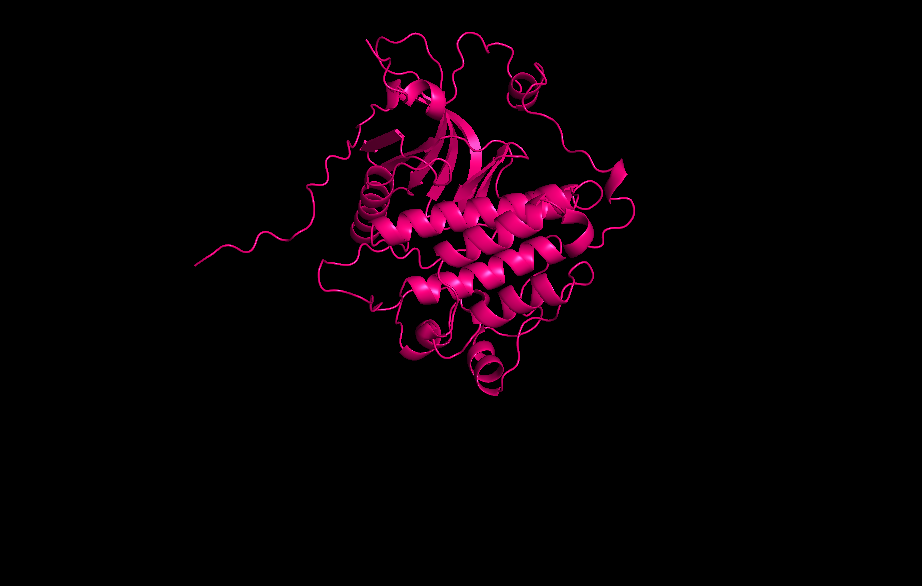

</div>

---

## Experimental vs Predicted Structural Alignment

<div align="center">

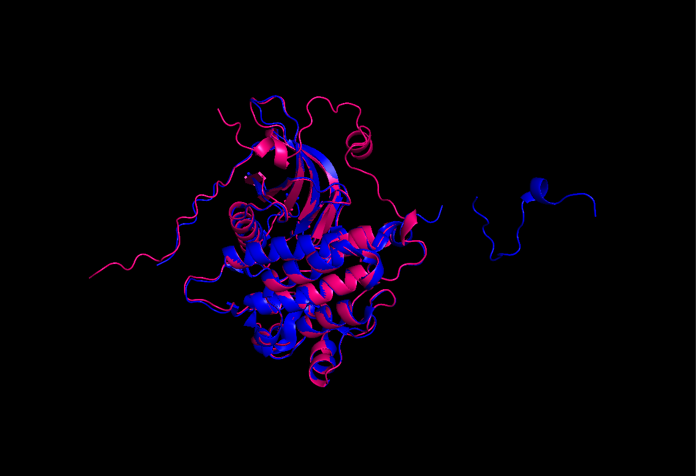

</div>

---

## Structural Metrics

| Metric | Result |
|------------|------------|
| RMSD | 0.484 Å |
| Atoms Aligned | 1831 |
| Structural Agreement | Excellent |

### Interpretation

The AlphaFold3-predicted structure showed strong agreement with the experimentally resolved EGFR kinase domain, with only minor deviations observed in flexible regions.

---

# 🏆 Key Findings

```diff
+ EGFR kinase domain selected as a clinically relevant cancer target
+ Binding site prediction matched the experimentally validated active site
+ Lapatinib demonstrated the strongest docking affinity (-11.6 kcal/mol)
+ Erlotinib showed the most balanced ADMET profile
+ AlphaFold3 achieved excellent structural agreement
+ RMSD = 0.484 Å
+ AI-based protein prediction closely reproduced experimental structure
```

---

# 📂 Repository Structure

```text
1m17-cadd-pipeline/

├── README.md
├── LICENSE
├── .gitignore
│
├── data/
├── docking/
├── structures/
│
├── figures/
│   ├── week1/
│   │   ├── full_protein.png
│   │   ├── binding_pocket.png
│   │   ├── binding_residues.png
│   │   ├── before_preparation.png
│   │   └── after_preparation.png
│   │
│   ├── week2/
│   │   ├── swissadme.png
│   │   ├── admet_result.png
│   │   ├── erlotinib_2d_interaction..jpg
│   │   ├── gefitinib_2d_interaction.jpg
│   │   └── lapatinib_2d_interaction.jpg
│   │
│   └── week3/
│       ├── alphafold_predicted.png
│       └── aligned_overlay.png
│
├── results/
└── docs/
```

---

# 🛠 Tools & Technologies

| Category | Tool |
|-----------|-----------|
| Protein Visualization | PyMOL |
| Protein Preparation | UCSF Chimera |
| Binding Site Prediction | DoGSiteScorer |
| Drug-Likeness Screening | SwissADME |
| Molecular Docking | PyRx (AutoDock Vina) |
| Interaction Analysis | BIOVIA Discovery Studio |
| ADMET Prediction | ADMETlab 3.0 |
| AI Structure Prediction | AlphaFold3 |

---

# 🌟 Scientific Relevance

EGFR is a clinically important receptor tyrosine kinase implicated in cancer progression and targeted therapy development.

This project demonstrates the integration of structural bioinformatics, molecular docking, pharmacokinetic profiling, and AI-assisted protein modelling within a unified computational drug discovery workflow.

---

# 👩‍🔬 Author

## Ayushi

**Final Year B.Sc. Chemistry**

Computational Biology • Bioinformatics • CADD

### Research Interests

🧬 Computational Biology

💊 Drug Discovery

🤖 Artificial Intelligence in Life Sciences

🔬 Structural Bioinformatics

---

<div align="center">

### ⭐ Star this repository if you found it useful.

### Computational Biology × Structural Bioinformatics × AI

</div>
